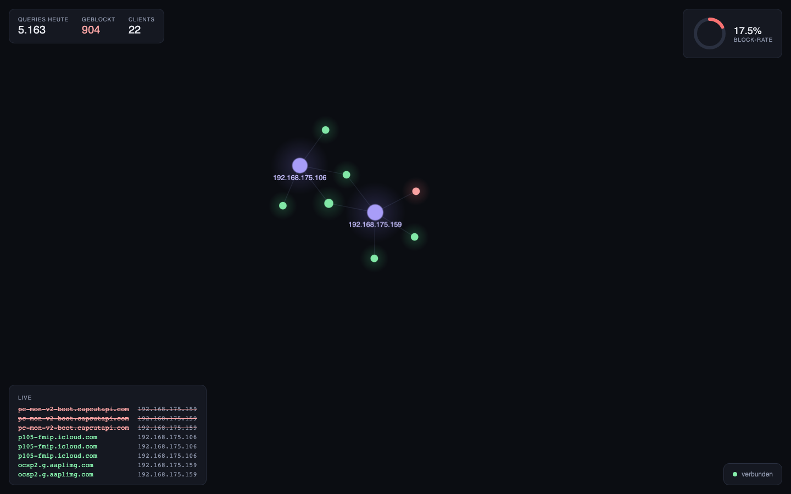

# pigraph

Obsidian-artiger Live-Graph für Pi-hole v6: Clients ↔ Domains als leuchtendes
Netz, geblockte Domains rot, 15-Minuten-Sliding-Window, Floating-HUD mit
Block-Rate und Live-Feed.



## Setup

1. App-Passwort im Pi-hole erzeugen: Settings → Web Interface / API →
   "Configure app password"
2. `cp server/.env.example server/.env` und `PIHOLE_PASSWORD` eintragen
3. `npm install`

> **Pi-hole im Docker?** Falls keine Queries ankommen: Settings → DNS →
> Interface settings → "Permit all origins" (Docker-NAT lässt LAN-Anfragen
> sonst als nicht-lokal erscheinen — Pi-hole ignoriert sie kommentarlos).

## Entwicklung

| Befehl | Wirkung |
|---|---|
| `npm run dev:server` | Backend-Proxy auf :5641 (pollt Pi-hole, SSE) |
| `npm run dev:web` | Vite-Dev-Server auf :5173 (proxyt /events, /api) |
| `npm test` | Alle Tests (shared, server, web) |

## Production

`npm run build`, dann reicht `npm run start -w server` — der Server liefert
`web/dist` mit aus: <http://localhost:5641>

## Architektur

SSE-Pipeline: Pi-hole v6 API → Poller (Cursor + Dedupe + Backoff) →
Broadcaster → `/events` → GraphStore (immutable, 15-min-Decay, 400-Domain-Cap)
→ Cluster-Transform (eTLD+1-Gruppierung) → d3-force → Pixi.js-WebGL-Renderer
(reine Vektor-Knoten, scharf bei jedem Zoom, Pulse bei neuen Queries).

Der Stream-Client heilt sich selbst über alle drei Ausfallarten: transiente
Netzfehler (EventSource-Retry), permanente HTTP-Fehler (manueller Reconnect)
und still gestorbene Sockets hinter Proxies (Heartbeat-Watchdog).

Details: `docs/superpowers/specs/` und `docs/superpowers/plans/`.

## Bedienung

- **Zoom** Mausrad · **Pan** Ziehen am Hintergrund · **Hover** Tooltip
- **Knoten ziehen** fixiert ihn an der Stelle (bis zum Reload)
- **Klick auf Knoten** öffnet eine Detail-Karte (Queries, Top-Domains/Clients,
  Block-Grund) und hebt bei Clients den Subgraph hervor; Klick ins Leere schließt
- **Cluster:** Domains derselben registrierbaren Domain klappen zu einem
  Super-Knoten mit Anzahl-Badge zusammen; Klick darauf klappt die Subdomains auf
- **Themes** unten rechts umschaltbar (Obsidian / Aurora / Nord), Wahl wird gemerkt
- Domain-Labels erscheinen ab Zoomstufe ~1.4× oder beim Aufpulsen

## Deployment (Raspi / Docker)

Der Server liefert das gebaute Frontend mit aus — ein Container genügt.

Auf dem Pi (Docker-Host):

```bash
git clone git@github.com:d56de/pigraph.git
cd pihole-viz
cp server/.env.example .env          # compose liest .env im Repo-Root
# in .env: PIHOLE_PASSWORD (App-Passwort) und PIHOLE_URL=http://pi.hole setzen
docker compose up -d --build
```

Aufrufen unter `http://<pi-ip>:8089`. Update: `git pull && docker compose up -d --build`.

> **Älteres Docker** (z.B. Raspberry Pi OS mit Docker ≤ 20.10): nutzt das
> Standalone-`docker-compose` (mit Bindestrich) statt des `docker compose`-
> Plugins — dann überall `docker-compose up -d --build`.
